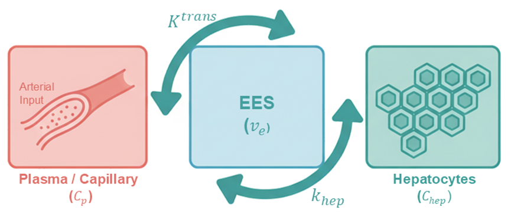
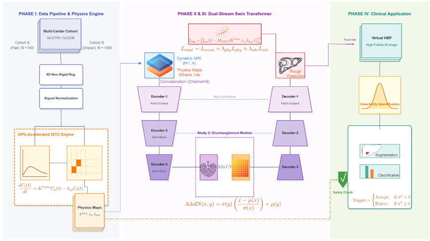

# Hepato-Synth: Physics-Informed & Disentangled Synthesis for Functional Liver MRI


**Hepato-Synth** is an intelligent computational imaging framework designed to overcome the "spatiotemporal dilemma" in liver MRI. By synergizing **Physics-Informed Deep Learning** with **Disentangled Representation Learning**, this project aims to accelerate Hepatobiliary Phase (HBP) imaging and synthesize virtual functional images from standard contrast-enhanced scans.

---

## 🌟 Core Philosophy: "Structure-Function Covariation"

This project addresses the ill-posed inverse problem of inferring intracellular function (OATP8 expression) from extracellular hemodynamics (Gd-DTPA perfusion).

Our approach is built upon two pillars:
1.  **Physics Engine (DITC)**: Utilizing the **Dual-Input Two-Compartment** model to extract explicit hemodynamic parameters as a "physical compass."
2.  **Biological Hypothesis**: We propose the **"Microvascular Fingerprint"** hypothesis — the differentiation grade of a tumor co-determines its microvascular topology (structure) and OATP8 expression (function). Deep learning is used to learn this non-linear mapping.

<div align="center">
  <!-- 这里的路径已根据您的截图修正 -->
  
  <br>
  <em>Figure 1: The core hypothesis linking microvascular structure to functional expression via differentiation grade.</em>
</div>

---

## 🚀 Key Features

### 1. GPU-Accelerated Physics Engine
*   **Real-time Fitting**: A CUDA-optimized parallel solver for the DITC pharmacokinetic model using `CuPy`.
*   **Performance**: Reduces voxel-wise fitting time for a whole-liver volume from hours (CPU) to **< 5 minutes** (GPU).
*   **Output**: Generates quantitative $K^{trans}$, $v_e$, and $k_{hep}$ parametric maps.

<div align="center">
  <!-- 插入物理模型图 -->
  
  <br>
  <em>Figure 2: The DITC physical model implementation strategy.</em>
</div>

### 2. Dual-Track Generative Framework
*   **Track A: Accelerated Imaging (Same-Modality)**
    *   **Model**: Physics-Informed Swin UNETR.
    *   **Mechanism**: Incorporates a novel **Physics Consistency Loss ($L_{physics}$)**.
    *   **Goal**: Predict HBP from early dynamic phases (0-5 min).
*   **Track B: Virtual Imaging (Cross-Modality)**
    *   **Model**: Disentangled Swin-DRIT++.
    *   **Mechanism**: Decouples image representations into "Domain-Invariant Content" and "Domain-Specific Style".
    *   **Goal**: Synthesize virtual HBP from cost-effective Gd-DTPA scans.

### 3. Trustworthy Diagnostic System
*   **Uncertainty Quantification**: Implements **Monte Carlo Dropout** to generate pixel-level confidence maps.
*   **Circuit Breaker Mechanism**: Automatically down-weights features from low-confidence regions.
*   **Multi-task Learning**: Simultaneous lesion segmentation and multi-class classification.

<div align="center">
  <!-- 注意：文件名中有空格，必须用 %20 替换 -->
  
  <br>
  <em>Figure 3: The closed-loop research framework: from Data to Physics, Generation, and Diagnosis.</em>
</div>

---

## 📂 Project Structure

```text
hepato-synth/
├── configs/                  # YAML Configuration files for experiments
├── data_preprocessing/       # Pipeline: DICOM -> NIfTI -> Registration -> Normalization
├── perfusion_modeling/       # Physics Engine: AIF Extraction & DITC Fitting (GPU)
├── generative_models/        # Core AI Models: Swin-UNETR & Swin-DRIT++
├── diagnostic_system/        # Trustworthy Diagnosis: Classifier & Uncertainty Quant.
├── scripts/                  # Execution scripts: train, inference, evaluate
├── utils/                    # Shared utilities: Metrics, Logging, I/O
├── demo/                     # End-to-end smoke test data & scripts
├── docs/                     # Documentation and Figures
└── main.py                   # Single entry point for the CLI
```

---

## ⚡ Quick Start (Demo)

We provide a lightweight demo to verify the pipeline architecture without needing real clinical data.

1.  **Clone the repository**:
    ```bash
    git clone https://github.com/LuDDDDDDH/hepato-synth.git
    cd hepato-synth
    ```

2.  **Install dependencies**:
    ```bash
    pip install -r requirements.txt
    ```

3.  **Run the end-to-end demo**:
    This script generates mock 4D data, simulates the physics engine, runs a training smoke test (1 epoch), and performs inference.
    ```bash
    python demo/run_demo.py
    ```

---

## 🛠️ Usage

### 1. Data Preparation
Organize your raw DICOM data into a BIDS-like structure using the parser:
```bash
python main.py --mode preprocess --input_dir /path/to/raw/dicoms
```

### 2. Physics Modeling (GPU)
Extract AIF and generate physical parameter maps ($K^{trans}$, $v_e$):
```bash
# This is automatically called within the training pipeline
# Or run standalone via scripts in perfusion_modeling/
```

### 3. Training
Train the acceleration model (Study 1):
```bash
python main.py --mode train --config configs/study_1_acceleration.yaml
```

### 4. Inference
Run inference on a new case with uncertainty estimation:
```bash
python main.py --mode inference \
               --config configs/study_1_acceleration.yaml \
               --checkpoint outputs/best_model.pth \
               --input_dir /path/to/new_case \
               --output_dir /path/to/results
```

---

## 📈 Roadmap

<div align="center">
  
</div>

- [x] **Phase I**: Infrastructure Setup & Data Pipeline (Done)
- [x] **Phase I**: GPU-Accelerated Physics Engine (Prototype Done)
- [ ] **Phase II**: Study 1 - Physics-Informed Acceleration (In Progress)
- [ ] **Phase III**: Study 2 - Cross-Modality Virtual Imaging
- [ ] **Phase IV**: Study 3 - Trustworthy Diagnostic System Validation

---

## 📧 Contact

For academic collaborations or technical inquiries, please open an issue or contact the maintainer.